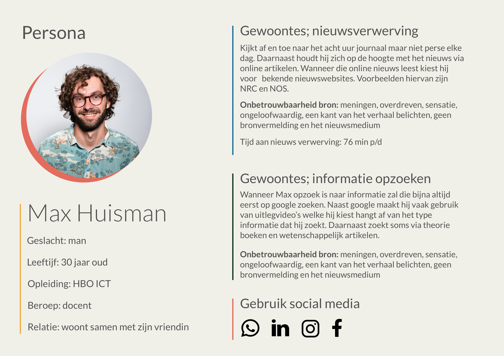

# Persona v1

## Persona versie 1

### Feedback

* Wat zijn de doelen?
* Wat is de motivatie?
  * Waarom zou je iets wel of niet doen?
* Als je minder tijd er mee kwijt bent ben je dan meer aan het uitdiepen of ben je dan alleen aan het scrollen
* Mannen besteden meer tijd aan nieuws waarom is dat? Je focust je nu op mannen maar je kan nog wel kijken waar dat tijdsverschil vandaan komt.
* Persona kan nog uitgebreid worden door interviews.
* Marije: Het moet over het gedrag gaan van de persona's
* Marije: Opvallende quotes kunnen wel helpen

###

### Bronnen:

[https://medium.com/microsoft-design/kill-your-personas-1c332d4908cc](https://medium.com/microsoft-design/kill-your-personas-1c332d4908cc)
