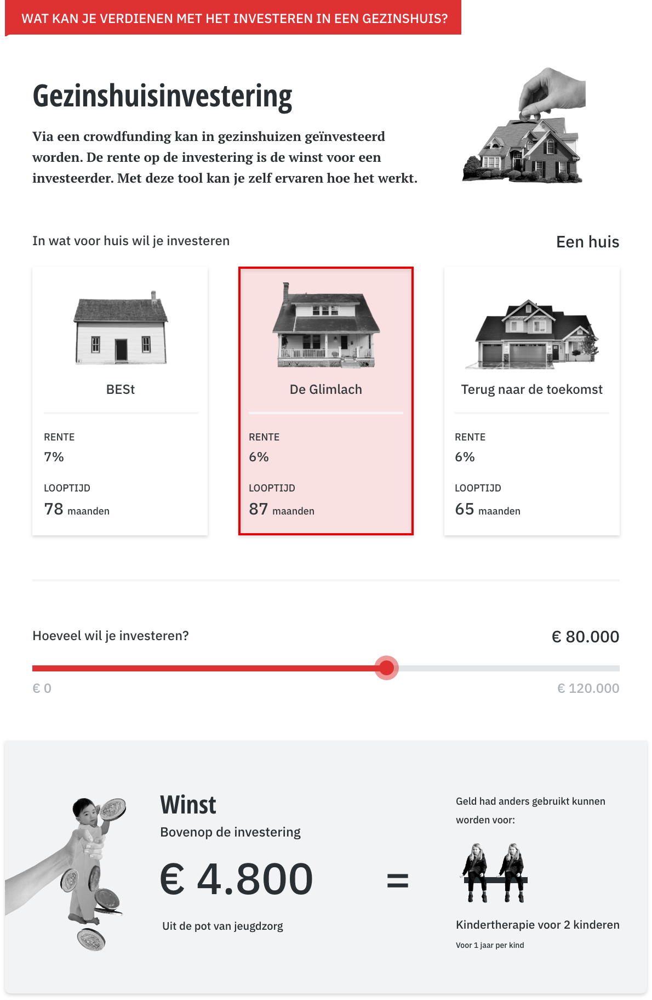
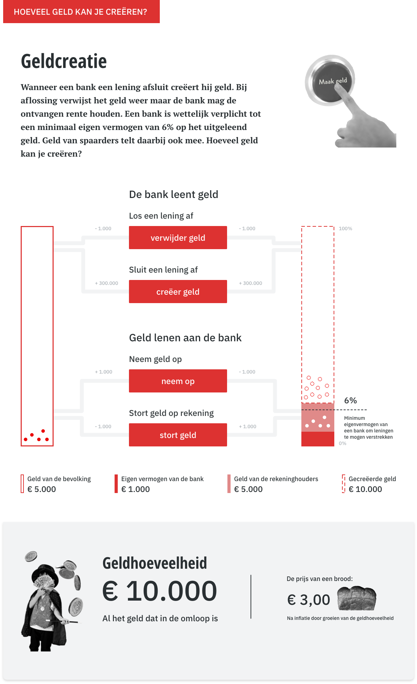
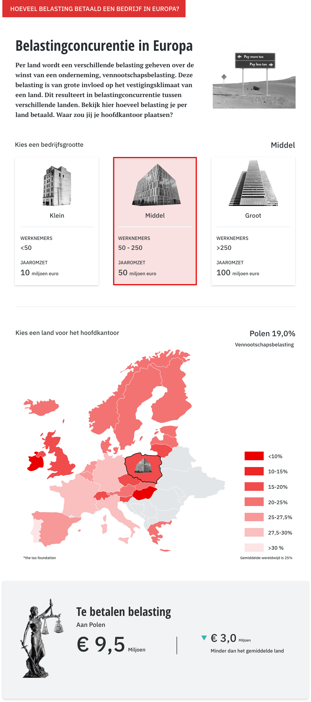

# De drie voorbeeld widgets

## Gezinshuisinvestering

### De widget

### Werking van de widget

Met deze widget kan berekend worden hoeveel winst gemaakt kan worden met een investering via crowdfunding. De drie opties zijn echt bestaande huizen die nog lopen of al gesloten zijn. Bij de opties is de rente en de looptijd te zien van de lening. Vervolgens kan met de schuif bepaald worden hoeveel geïnvesteerd wordt.&#x20;

Het resultaat geeft de uiteindelijke winst weer. Tot slot is een vergelijking te zien met andere dingen die bekostigd hadden kunnen worden vanuit de jeugdzorg in plaats van jou rendement.

## Geldcreatie

### De widget

### Werking van de widget

De interactie van de widget bestaat uit vier knoppen. Met de knoppen kan ‘geld’ in de vorm van bolletjes over de balken verdeeld worden. Daarnaast is er een knop die nieuw geld gegenereerd en een knop die geld laat verdwijnen. Het is een schematische weergave van geldcreatie. Wanneer geld wordt gestort op de bank door burger komt dat bij het vermogen van de bank. Wanneer het vermogen van de bank hoger is dan 6% van zijn totaal kan hij leningen verstrekken. Deze leningen komen weer bij de bevolking die dat weer op de bank kan zetten. Zo is er een oneindige creatie van geld. Daarnaast kunnen leningen ook afgelost worden dan verdwijnt er weer geld. Ook kan er direct geld opgenomen worden dat komt direct bij de burger terecht uit het vermogen van de bank.&#x20;

Het resultaat dat getoond wordt is de totale geldhoeveelheid. Verder wordt deze vergeleken met de prijs van een brood. Deze zal stijgen door inflatie wanneer de geldhoeveelheid groeit.

## Belastingconcurentie

### De widget

### Werking van de widget

Door middel van deze widget kan bekeken worden wat het effect van belastingconcurentie is. Bij de drie keuzes kan een formaat bedrijf gekozen worden. Bij het formaat bedrijf hoort een bepaalde jaaromzet. Vervolgens kan een land aangeklikt worden. Ieder land heeft een eigen vennootschapsbelasting. Deze belasting gaat van de omzet af.&#x20;

Het bedrag dat af gedragen moet worden aan de belasting van dat land is het resultaat. Daarnaast is te zien hoeveel meer of minder dan het gemiddelde er betaald moet worden aan vennootschapsbelasting.
